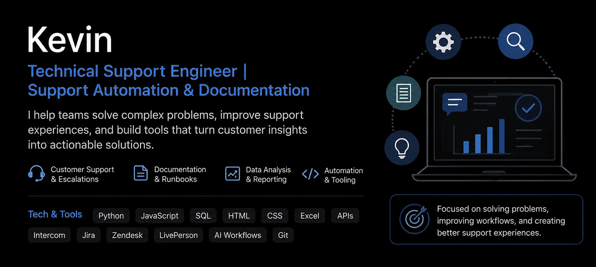

<!-- Profile README: 0xcyb3rv1k1ng -->

  

<h2 align="center">Technical Support Engineer • Support Automation • Documentation • Data Analysis</h2>

## About

- 🛠️ Technical Support Engineer focused on troubleshooting, support automation, documentation, and customer issue analysis
- 🌐 Experienced in escalated case investigation, support operations, runbooks, and process improvement
- 🤖 Daily user of AI tools to improve research, reporting, documentation, and operational workflows
- 🧰 Background in JavaScript, Python, SQL, Excel, support systems, and customer-facing technical support
- 🔐 Prior blockchain/security background with current focus on technical support engineering, automation, and documentation
- ⚡ Fun fact: Top 10 score worldwide on *Galaga*

---

## Focus areas

- 🚀 Support automation and internal tooling
- 📄 Technical documentation, runbooks, and knowledge base workflows
- 🔎 Customer issue investigation and root-cause analysis
- 📊 Reporting, trend analysis, and operational insights
- 🤖 AI-assisted workflows for support, research, and documentation
- 🧭 Developer support, customer success engineering, and technical operations

---

## Featured work

- **iBuddy** — support analytics workflow for extracting, organizing, and analyzing support conversations
- **StarScoop** — review triage tool for cleaning, deduplicating, categorizing, and summarizing app review feedback
- **Support runbooks** — documentation workflows for repeatable troubleshooting and escalation handling
- **AI-assisted workflows** — reusable processes for summarizing issues, improving documentation, and identifying recurring patterns
- **Technical support operations** — high-volume case management, escalation research, and customer issue resolution

---

## Tech & tools

`Python` `JavaScript` `SQL` `HTML` `CSS` `Excel` `Google Sheets`  
`Intercom` `LivePerson` `Zendesk` `Jira` `GitHub` `APIs`  
`ChatGPT` `Claude` `Gemini` `Perplexity` `Cursor`

---

## Certifications / Background

- B.S. Computer Science - University of the People
- A.S. Computer Science - University of the People
- Full Stack Developer Certificate - Kingsland University
- Blockchain Developer Certificate - Kingsland University
- Certified Blockchain Engineer

---

## Current direction

I am focused on roles where I can combine technical troubleshooting, customer support, documentation, automation, and data analysis to improve how teams resolve complex issues. My strongest areas are support engineering, customer success engineering, technical operations, reporting workflows, and AI-assisted process improvement.
---

### GitHub stats

  

